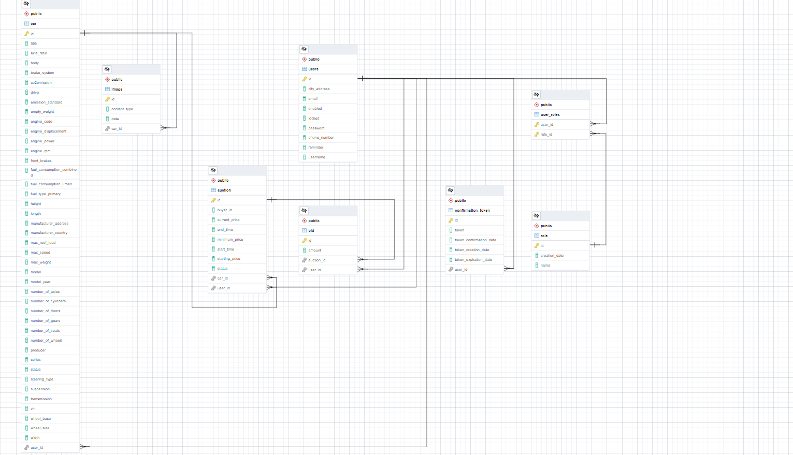

# Welcome to Auctions Hunters Service!

## Table of contents

* [General info](#general-info)
* [Prerequisites](#prerequisites)
* [Technologies](#technologies)
* [Architecture](#architecture)
* [ERD](#erd)
* [Deployment instructions](#deployment-instructions)
* [How to run this service locally](#how-to-run-this-service-locally)
* [Testing](#testing)
* [Features](#features)
* [Developers](#developers)

## General info

This project represents a car auction web app that offers an immersive bidding experience for automobile
enthusiasts and potential car buyers.
The application showcases a vast selection of vehicles from various makes, models, and years for users to explore and
bid on.
Users can delve into detailed car descriptions, view high-quality images, and place their bids in real time.

## Prerequisites

To run this project you should have the following technologies installed:

* IntelliJ/Eclipse
* Maven
* Java 17

## Technologies

The backend is done by using:

<a href="https://www.oracle.com/java/technologies/javase-jdk17-downloads.html">
    
</a>

<a href="https://spring.io/">
    
</a>

<a href="https://www.postgresql.org/download/">
    
</a>

<a href="https://maven.apache.org/download.cgi">
    
</a>

The frontend is done by using:

<a href="https://www.thymeleaf.org/">

</a>

## Architecture

This project was created using an MVC (Model-View-Controller) architecture. That means that the application is separated
into three main logical components: the model, the view, and the controller.
Each of these components are built to handle specific development aspects of an application.

## ERD



## Deployment instructions

For the deployment part it was used Elastic Beanstalk provided by the [AWS](https://aws.amazon.com/).

## How to run this service locally

In order to activate the logs at the debugging level, set the Active Profiles to

```shell
SPRING_PROFILES_ACTIVE=debug
```

Replace the environment variables defined
in [application.yml](https://github.com/bigbrain2000/AuctionsHunters/blob/main/src/main/resources/application.yml) with
your own credentials. That means that you will need a [Mailtrap](https://mailtrap.io/), [Vicario](https://vindecoder.eu/), [PayPal](https://developer.paypal.com/) and an [AWS](https://aws.amazon.com/) account.

Run the project by running the following commands:

```shell
$ mvn clean install
$ mvn spring-boot:run
```

## Testing

The service has been tested by using unit tests that can be
found [here](https://github.com/bigbrain2000/AuctionsHunters/tree/main/src/test/java/com/auctions/hunters).

## Features

<p>
	Users, whether buyers or sellers, can create an account within the app to take advantage of the options it offers. The process for customers to register their cars in the app in order to value them is very simple, the only thing they need is the car's chassis number and a series of photos to highlight the car's appearance. This automated approach guarantees an objective and comprehensive presentation of the vehicle to potential buyers, increasing users' confidence in the transaction process and its full transparency; therefore, using the app contributes to improving the user experience.
	After entering a car in the app for the purpose of sale, the next step required by the seller is to create an auction by entering the minimum price they accept for the sale of the vehicle. The auction created will be open for twenty-four hours from the moment of creation and is based on the English auction model, one of the most popular auction methods due to its transparency.
	Once the auction starts, potential buyers can express their interest in the auction by offering a higher price than the current one. Each subsequent bid must be higher than the to remain in the competition. At the end of the auction, the winner is the user who offered the highest bid. This is a distinctive feature of the auction system and differs from other types of auctions. If the auction is of no interest to potential bidders it ends without any bidding from them and the seller can create bids with that machine until it is sold.
	Bidders, during the auctions they participate in, will be notified if their bids have been outbid by another bidder, as well as when they have won their bids. In order to successfully close the auction and claim the rights to the car, the user who won the auction must pay the final price of the car via the PayPal application.
</p>

## Developers

[Roncea Marius-Alexandru](https://github.com/bigbrain2000)